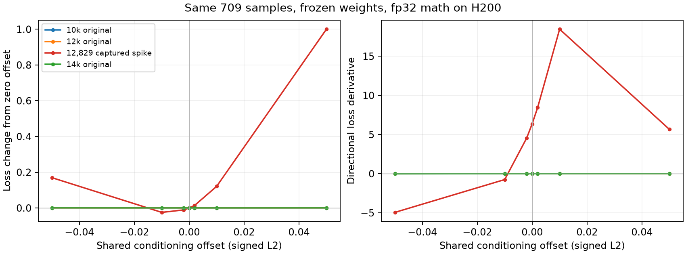
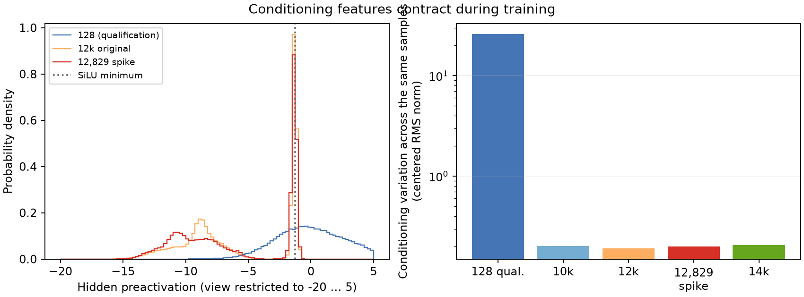

# H200 spike root-cause investigation — 2026-09-24

> Archived record. Current pretraining decisions and status are in
> [the Ascend plan](../ascend_pretraining_0924.md); old launch commands and
> configuration switches require the source revision used for that run.

The user requested a mechanism, rather than further LR reductions or a
hardware switch. The H200 hero remains stopped; independent Ascend jobs are
not modified. Launch, incident, and trajectory-replay history:
[H200 operational record](h200_smoke_0923.md).

**Confirmed mechanism (10:21 CST):** at captured H200 step 12,172, AdamW's
update to `c_mlp.2.weight` produces a coherent conditioning shift amplified
**144×** relative to the explicit bias update. Its almost constant hidden
features turn coordinate-wise weight updates into a large effective bias
update shared by every block. The weight update alone produces gradient
norm **55.82**; removing only its mean-input component from the otherwise
complete update gives **0.248**, versus **45.04** for the full update.
Exact optimizer reconstruction is bit-identical. The immediate causal
mechanism is established for this event. The origins of feature contraction,
all Ascend events, and a durable training fix are not yet experimentally
settled; no production remedy or hero restart has been performed.

## Same-state numerical and cross-card test (09:39 CST)

An observer captured the first >10 gradient event in a replay from the
protected 12k checkpoint, before optimizer/EMA update: step **12,829**,
loss **0.973399**, gradient norm **41.212498**, 709 samples across four
ranks and three micro-batches per rank. All four complete model states,
parameter hashes, and clipped-gradient hashes are identical. The capture
contains exact DiT inputs, frozen text features, outputs, weights and
gradients; it is **not a resumable checkpoint** (no optimizer/RNG state).

The same weights and all 709 inputs were replayed without optimizer updates:

| Device / execution | Loss | Gradient norm | Cosine to captured gradient |
| --- | ---: | ---: | ---: |
| H200 compiled bf16 | 0.973478 | 41.166180 | 0.999970 |
| H200 eager bf16 | 0.974043 | 41.756997 | 0.999869 |
| H200 math attention bf16 | 0.974089 | 41.646670 | 0.999884 |
| H200 math attention fp32, TF32 off | 0.972703 | 41.709637 | 0.999695 |
| RTX 4090 eager bf16 | 0.975249 | 41.758911 | 0.999827 |
| RTX 4090 math attention fp32, TF32 off | 0.972703 | 41.709521 | 0.999695 |

The spike is a large mathematical gradient at this model state. Immediate
bf16 arithmetic, compilation, distributed reduction, or Ascend-specific
kernels are not required. The fp32 results agree across cards to ~0.0003%
in gradient norm. This does **not** exclude small numerical differences
earlier in training moving the trajectory into this state at different
steps. Serial accumulation and chunking change reduction order; bitwise
identity to the original DDP backward was not expected.

In fp32, `c_mlp.2.weight` norm is **39.715924**, accounting for **90.66%**
of squared total gradient norm. Next are `txt_pooled_proj.weight` (9.600027),
`c_mlp.2.bias` (6.372995), and `c_mlp.0.weight` (5.274025). All four belong
to auxiliary AdamW. This localizes the gradient; it does not establish why
that path became sensitive. The earlier full-fp32 Muon NS trajectory arm
also spiked and produced EMA texture collapse, rejecting NS promotion as a
sufficient fix.

Jobs `h200-spike-replay-0924` and `h200-spike-reference-4090-0924` both
succeeded (09:31:55 / 09:33:50 CST). Shared artifacts under
`$W/runs/h200-hero-256p-investigation-10282`:

- `capture-0924/capture/event_012829`: raw captured tensors and identities.
- `spike-replay-0924` / `spike-replay-4090-0924`: per-mode results including
  all parameter gradient comparisons, micro-batch losses and logs.
- `numerical-replay-summary.json`: combined numerical results.

## Conditioning-path investigation (completed, 09:43 CST)

`h200-condition-path-0924` replays the same captured inputs with live weights
from 10k, 12k, spike 12,829, and original 14k, one H200 per state. All use
eager fp32 math attention, TF32 off, no optimizer updates. It measures:

- Input activation `h`, output `c`, and backward gradient at the final
  shared-conditioning linear layer. For each sample, its weight-gradient
  contribution has norm `||h|| * ||dL/dc||` (with actual global weighting).
- Each block modulation branch's separate contribution to `dL/dc`, checked
  against their sum; modulation component scales.
- LayerNorm / QK RMSNorm input scales and local backward amplification.
  Identity clones isolate each normalization branch so residual gradients
  are not incorrectly counted as its Jacobian amplification.

Comparison outputs: `condition-path-0924/<state>/result.json`. These are
observations, not proposed recipe changes. The next intervention depends
on the measured source of amplification.

The hook-instrumented spike result agrees with the uninstrumented fp32
reference (loss 0.9727028643, norm 41.7096369). Local modulation gradients
sum exactly to the gradient at `c`. The identical batch gives:

| Weights | Loss | Total gradient norm | Median conditioning-output gradient per sample, globally weighted |
| --- | ---: | ---: | ---: |
| Original 10k | 0.852536 | 0.390651 | 0.0002876 |
| Original 12k | 0.849701 | 0.263390 | 0.0003309 |
| Replay spike 12,829 | 0.972703 | 41.709637 | 0.0136361 |
| Original 14k | 0.846196 | 0.451796 | 0.0003625 |

The 14k state is from the original trajectory, not a continuation of the
captured replay. At the spike, the largest single sample contributes only
**0.83%** of the sum of individual `c_mlp.2.weight` gradient norms; the top
ten contribute **5.97%**. Contributions span all timestep quintiles. The
large batch gradient combines broadly larger individual contributions and
greater directional alignment (norm of summed weight gradient divided by
sum of individual norms: **0.525**, versus **0.114** at 12k).

Conditioning activation magnitudes remain moderate (`c` median norm 17.03,
versus 16.58 at 12k; final-linear input `h` 6.23 versus 6.32). No measured
normalization branch has a sudden backward amplification: the largest
per-sample norm ratio is 2.64 at the spike, versus 2.66 at 12k, both in the
first image LayerNorm. Thus neither activation overflow, a single poisoned
sample, nor a singular normalization denominator explains this event.

## Shared-conditioning sensitivity (completed, 09:49 CST)

`h200-condition-geometry-0924` freezes checkpoint weights and adds a shared
offset `alpha * d` to the conditioning vector of every sample, where `d`
is the unit captured conditioning-bias gradient. It evaluates the same 709
samples in fp32 math and differentiates only that offset. This directly
measures the downstream network's loss response to conditioning changes.

The centered finite-difference curvature at alpha=0 (epsilon=0.002) is:

| Weights | Directional curvature |
| --- | ---: |
| Original 10k | 0.1334 |
| Original 12k | 0.1902 |
| Replay spike 12,829 | **976.15** |
| Original 14k | 0.2191 |

The spike-state curvature is **~5,130×** the 12k curvature along this same
direction. Its loss is 0.94814 / 0.97270 / 1.09369 for alpha=-0.01 / 0 /
+0.01; a +0.05 offset raises loss to 1.97305. The conditioning vector's norm
is ~17, so these are small absolute displacements. This is a sharply
sensitive model state, not a faulty immediate gradient computation.

The shared conditioning features have little variation compared with their
mean: at the spike, `c` mean norm 17.0235, centered RMS norm 0.2003. Meanwhile
Muon-routed modulation weight norms grow: block-0 text modulation Frobenius
norm 740.97 at 10k, 858.82 at 12k, 907.31 at the spike, 948.50 at original
14k; its estimated spectral norm is 66.16 / 77.22 / 81.38 / 87.51. The last
block's modulation spectral norm grows 80.83 / 100.10 / 107.10 / 121.40.
Growing modulation gain plus weak feature variation is a concrete lead;
**these correlations alone do not establish Muon routing as the cause**.

Source inspection also found that the current sinusoidal time embedding
receives t in [0,1] without a frequency multiplier; the
[official FLUX implementation](https://github.com/black-forest-labs/flux/blob/main/src/flux/modules/layers.py)
uses `time_factor=1000`. This difference was an untested architectural lead
at the time of the H200 probes. Later on September 24, the user reported that
the fresh Ascend `tf1000-256p` experiment did not resolve the issue; the
factor change alone is therefore insufficient. See the
[Ascend pretraining decision](../ascend_pretraining_0924.md) for the evidence
boundary and the current experiment direction. In the captured
weights, a full t=0→1 sweep at fixed pooled text still changes `c` by norm
0.89, so timestep information is not simply absent.

Raw geometry and loss-profile results: `condition-geometry-0924/<state>`;
combined compact results: `conditioning-summary.json` in the incident root.



## Conditioning hidden-state contraction (10:02 CST)

A CPU fp32 check loads only the conditioning weights and the same captured
pooled features/timesteps. The qualification's fresh step-128 checkpoint is
an early-state comparison, not a predecessor checkpoint of the hero.

| Weights | Mean positive hidden neurons / 1152 | Fraction with abs(SiLU derivative)<0.01 | Centered RMS norm of `c` |
| --- | ---: | ---: | ---: |
| Fresh qualification 128 | 576.7 | 2.14% | 25.8845 |
| Original 10k | **0** | 50.76% | 0.2021 |
| Original 12k | **0** | 61.86% | 0.1920 |
| Replay spike 12,829 | **0** | 60.55% | 0.2003 |
| Original 14k | **0** | 68.57% | 0.2063 |

All 709×1152 measured hidden preactivations are negative by 10k. Many sit
near SiLU's minimum at -1.27846; others move far down its saturated negative
tail. At 12k, 54.01% are below -5, and another 20.98% lie within 0.1 of the
minimum. The timestep branch's mean-vector norm grows from 19.78 at
qualification 128 to 163.40 at 12k, largely producing a negative offset.
The output conditioning variation falls by ~135×, while the modulation
weights consuming it grow. This establishes a contracted, increasingly
insensitive upstream feature representation paired with large downstream
gain. Its causal relationship to spikes still needs the preceding-update
counterfactual and a controlled intervention; no production change is made.

CPU result: `conditioning-hidden-saturation.json`. This reads captured
features rather than rerunning the text encoder, and does not claim that
every future training sample has the same activation pattern.



## Exact preceding-update capture (completed, 10:04 CST)

`h200-predecessor-capture-0924-r1` replays from the protected 12k checkpoint
with the original recipe, stopping at the first norm>10 or at 14k. It retains
the immediately preceding pre-update model, optimizer states, clipped
gradients and every rank's inputs, alongside the spike state and its current
optimizers. This enables exact one-update and parameter-group counterfactuals
instead of extrapolating across checkpoints hundreds of steps apart.

The first allocation was stopped during startup to replace per-update CPU
copies with independent device clones; training already peaks near 32 GiB,
so the H200 has ample memory for these snapshots. The observer never writes
into training tensors. Only the triggered snapshot is serialized. These
captures still omit sampler/RNG/EMA state and are not resumable checkpoints.
Source, patch, hashes and override are under `predecessor-0924-r1`; isolated
source is `$W/repo-h200-0924-predecessor`. Hero and Ascend runs are untouched.

The retry captured **step 12,172**, loss 1.039692, raw gradient 43.693565,
612 samples / global weight 623.239990. Every rank's model and clipped
gradient hashes agree. The preceding update was step 12,171, loss 0.845365,
raw gradient 1.622501 (the preceding ten steps were mostly 0.25–0.42).
Artifacts: `predecessor-0924-r1/capture/event_012172`.

## Causal isolation of the triggering update (completed, 10:09 CST)

`h200-update-counterfactual-0924` first reconstructed the preceding optimizer
step from its saved weights, optimizer states and clipped gradients. Every
resulting parameter matches the captured next state **bit-for-bit**:
maximum absolute difference and total L2 difference are both **zero**.
This includes the original compiled bf16 Muon operation and auxiliary AdamW.

It then evaluated exact saved old/new parameter combinations against the
**same next-step spike batch** (fp32 math, no further training):

| Which parts of update 12,171 are applied? | Loss | Gradient norm |
| --- | ---: | ---: |
| None: preceding model | 0.861786 | **0.291766** |
| All: actual next model | 1.039057 | **45.036572** |
| Only conditioning heads (`c_mlp`, `txt_pooled_proj`) | 1.020018 | **48.753910** |
| Everything except conditioning heads | 0.860915 | **0.212786** |
| Only AdamW parameters | 1.019759 | 48.297610 |
| Only Muon parameters | 0.860866 | **0.211499** |
| Only block modulation parameters | 0.861090 | 0.246268 |
| Only `c_mlp.2` weight and bias | 1.028974 | **55.759607** |

For this captured event, the final shared-conditioning linear layer's
AdamW update is **sufficient** to trigger a spike; the rest of the update
without conditioning is clean on the identical batch. This is a causal
parameter-update isolation, stronger than gradient localization or a
precision correlation. It does not alone attribute every Ascend event.

The actual AdamW LR is **0.000186465**, betas (0.9,0.95), epsilon 1e-8.
The final conditioning weight changes by Frobenius norm 0.046210 (weight
norm 32.9194); its bias changes by only 0.001420. Despite that modest
relative weight displacement, its update moves the conditioning output by
**0.206073 RMS norm**, almost exactly a common shift across all 612 samples
(mean-shift norm 0.206073, alignment ratio 0.9999996). The previous
between-sample conditioning spread is only **0.196283**. Thus one weight
update moves nearly every sample's shared conditioning farther than the
entire RMS variation separating their conditioning signals. All conditioning
heads together move it by RMS norm **0.227869**.

The final-weight AdamW update points downhill against its input gradient
(cosine -0.6464); this is not a sign inversion or a stale-momentum ascent
step. Its near-constant hidden features let many coordinate-wise weight
updates combine into a large effective bias change. The downstream
modulation path then turns that shared displacement into a spike. The
follow-up `h200-update-scale-0924` tests the actual step-size threshold,
weight versus bias contributions, and removal of only the weight update's
common-input component. These are causal probes, not adopted safeguards.

Results: `update-counterfactual-0924/<arm>/result.json`,
`optimizer-reconstruction.json`, `adam-step-analysis.json`, and each arm's
saved `conditioning.pt`.

## Mean-input component and step-size counterfactual (completed, 10:14 CST)

The last eight-arm fp32 replay isolates the final layer's **weight** update:
weight alone gives norm **55.8181**, whereas bias alone gives **0.2921**.
Let `h_bar` be the mean final-linear input on the fixed spike batch evaluated
with the preceding weights. For this forensic ablation, remove only the
weight update component acting on that mean:

```
delta_W_projected = delta_W - (delta_W @ h_bar)[:, None]
                            * h_bar[None, :] / (h_bar @ h_bar)
```

Applying the complete captured update with only this one component removed
gives **loss 0.861532, gradient norm 0.247787**. Applying only the projected
final-layer update gives norm 0.292111, effectively the same as bias alone.
This confirms the shared conditioning displacement as the decisive part of
the weight update for this captured event. The reference mean uses the next
batch for a controlled forensic decomposition; this is **not** yet an online
training algorithm or a validation of a deployable projection safeguard.

The optimizer mechanism is measurable. The hidden features are negative and
almost constant across samples. Then approximately
`grad_W[i,j] = grad_bias[i] * h_bar[j]`. Adam's coordinate normalization
largely removes the magnitude of `h_bar[j]`, so many columns contribute in
the same direction to `delta_W @ h_bar`, amplifying the bias-like motion:

- `||h_bar||_1 = 146.58295`.
- `||delta_W @ h_bar|| = 0.2046534`.
- `||delta_bias|| = 0.00141963`; their norm ratio is **144.1594**.
- The weight-induced shift and explicit bias update have cosine **0.999872**.
- The actual weight update has cosine **0.94237** to a matrix formed by
  repeating the negative bias update across all columns. This is an
  approximation, not an exact factorization (relative residual 0.3496).

Keeping all other parameters at their updated values and interpolating only
the conditioning-head update gives:

| Fraction of actual conditioning update | Next-batch loss | Gradient norm |
| --- | ---: | ---: |
| 0 | 0.860915 | 0.212786 |
| 0.1 | 0.861023 | 0.218953 |
| 0.25 | 0.861384 | 0.248686 |
| 0.5 | 0.863065 | 0.841935 |
| 0.75 | 0.908917 | **28.6570** |
| 1 | 1.039057 | **45.0366** |

Reducing the conditioner step avoids this particular crossing. It does not
remove the near-constant feature representation or downstream gain growth;
therefore delayed recurrence after an LR reduction is consistent with the
mechanism. The experiment does not prove the long-term outcome of a new LR.
The remedy should be tested at the conditioning parameterization/update
level, with a trajectory replay and EMA evaluation, rather than adopted
from this single-update success. Neither fp32 Muon nor global spike skipping
addresses the demonstrated amplification directly.

Artifacts: `update-scale-0924/<arm>/result.json`,
`update-counterfactual-0924/common-mode-adam-analysis.json`, and
`causal-update-summary.json` (all 16 counterfactual arms). All GPU diagnostic
jobs have finished successfully. Completed temporary launchers and isolated
observer source are removed after retaining patches, hashes, raw captures,
results and this evidence. The frozen production source remains unchanged.
